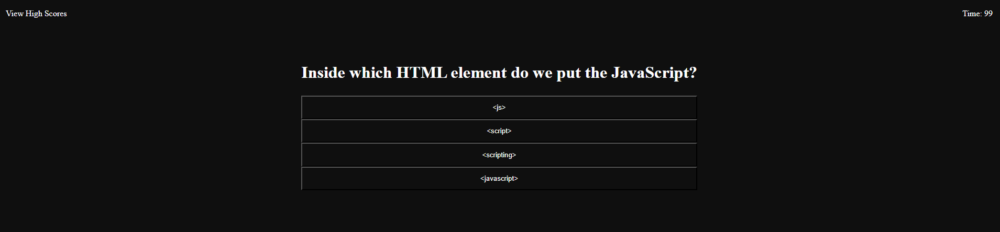

# Javascript Code Quiz

## Description

This project was started with the intention of creating a coding quiz for javascript. I created this page and it took longer than expected to do the javascript function to have the website working as intended. I am planning on coming back to this project later when I have more time to fix certain bugs or styling issues on the page. The code works to display the questions for the user to answer and also keeps track of their score. The high scores page keeps track even on reload of the page and has a reset button to remove them all. Currently they do not sort by the actual highest score but it will display all of the scores entered from first to last (in terms of who did the quiz first-last).

## Example of Password Generator

[Deployed Application Here](https://collinshepherd.github.io/code-quiz/)

## Usage

To use this website first you click the start button and it will show you (currently only 4) the questions in a random order each time and keep track of your score. After you either run out of time or answer all of the questions you will be prompted to enter your name and then it will take you to the high scores page where then you can look at the high scores and also in the top left there is a button for you to retake the quiz. It will reset all of the variables and allow you to retake it without refreshing the page.

## Credits

I used lots of https://www.w3schools.com/ references to understand certain functions of my webpage and I was very grateful for the open database of for lots of information. I also had my dad (a senior programmer) help me with the arrow function in the js to remove the high scores when they are clicked.

## License

Please refer to the LICENSE in the repo
